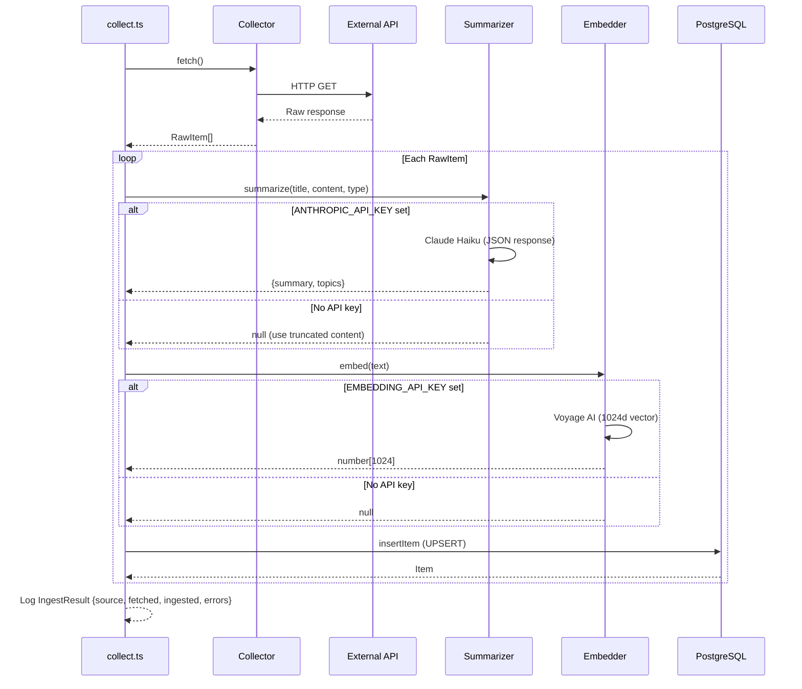
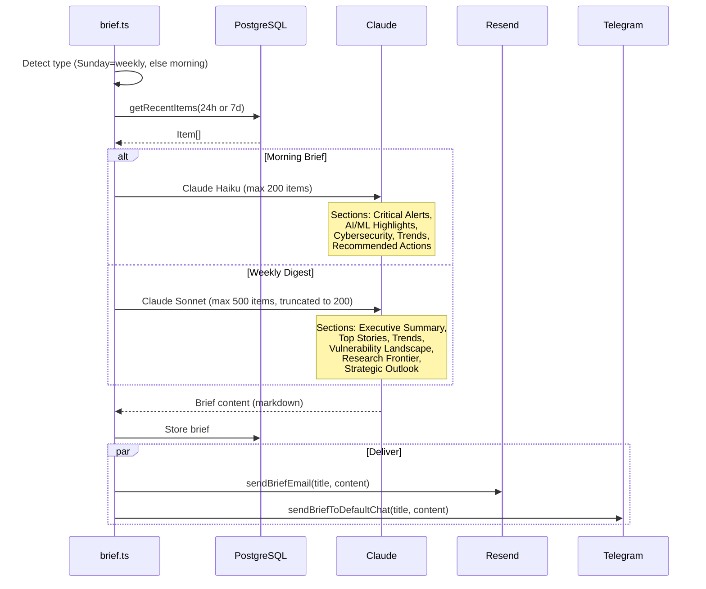
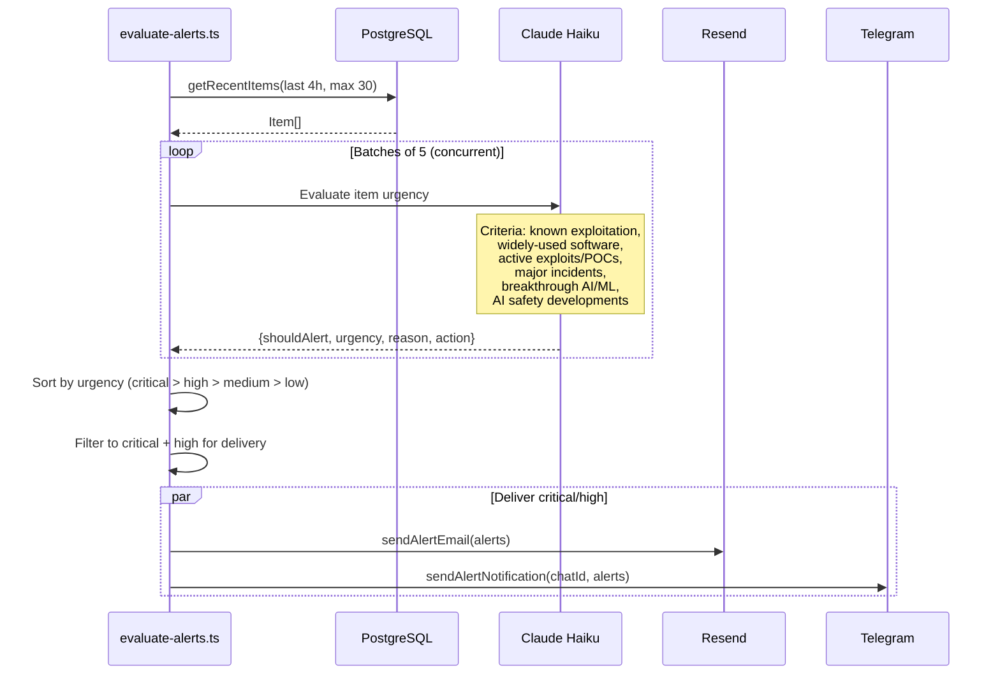
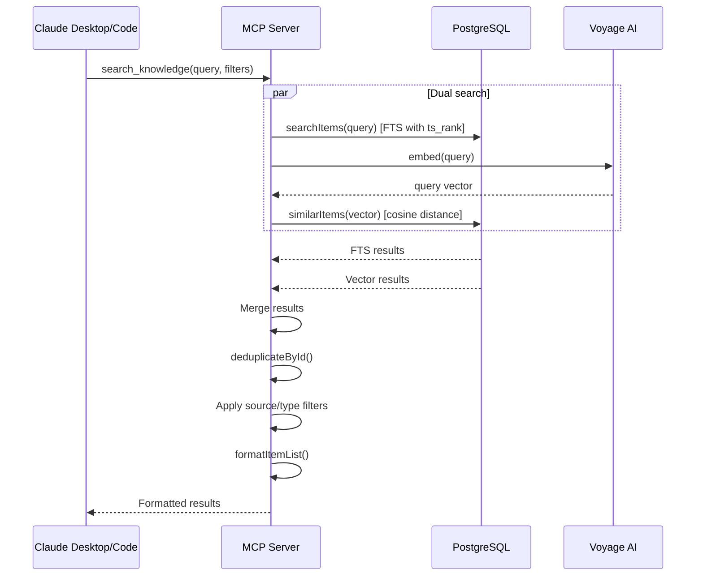
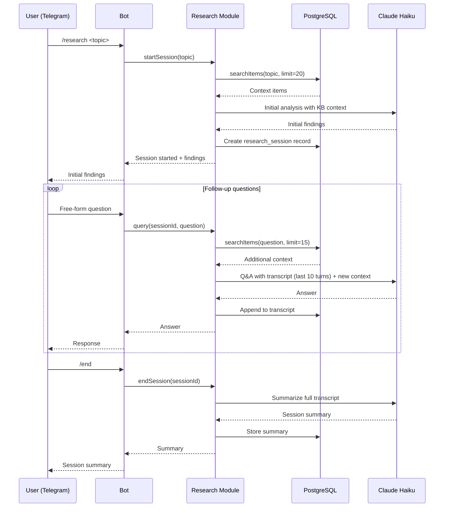

# Data Flow

## Collection & Ingestion

`bun run collect` runs all collectors sequentially, pipes each batch through the ingest pipeline.

Each collector has its own fetch strategy:

- **NVD**: Last 24 hours by publish date, 100 results per page
- **CISA KEV**: Full JSON feed, filtered to last 7 days by dateAdded
- **GitHub Advisories**: Type=reviewed, 50 per page, maps severity + CWE
- **arXiv**: 4 CS categories (AI, CR, LG, CL), 50 results, sorted by submit date
- **Inoreader**: Reading list stream, 100 items per page, extracts labels as topics

## Brief Generation

`bun run brief` generates daily or weekly summaries.

## Alert Evaluation

The `bun run alerts` job triages recent items for urgency.

## MCP Search

The MCP server's `search_knowledge` tool combines full-text and vector search.

## Research Session

Interactive multi-turn research via the Telegram bot or MCP.

