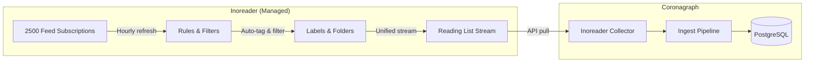

# Infrastructure: Inoreader

Inoreader Pro handles RSS/newsletter/social feed polling and aggregation. Coronagraph pulls from it via API rather than polling feeds directly.

## What Inoreader Provides

| Capability | Detail |
|-----------|--------|
| Feed subscriptions | Up to 2,500 RSS/Atom feeds |
| Refresh rate | Hourly feed refresh (automatic) |
| Rules & filters | Up to 30 automation rules for tagging/filtering |
| Duplicate filters | Up to 10 duplicate detection rules |
| AI summaries | Built-in AI-generated article summaries |
| Labels & folders | Hierarchical organization of content |
| Content types | Web feeds, newsletters (email-to-RSS), social feeds |
| Search | Full-text search across all subscribed content |
| Reading list | Unified stream of all incoming content |

## Integration Architecture



## API Constraints

Inoreader Pro provides API access with rate limits organized into two zones:

| Zone | Quota | Resets | Examples |
|------|-------|--------|----------|
| Zone 1 (Reads) | 100 requests/day | Daily | Stream contents, subscriptions, tags |
| Zone 2 (Writes) | 100 requests/day | Daily | Mark as read, add tags, subscribe |

### Authentication

Inoreader uses OAuth 2.0 with three credentials:

| Env Var | Purpose |
|---------|---------|
| `INOREADER_APP_ID` | OAuth client ID (Application ID) |
| `INOREADER_APP_KEY` | OAuth client secret (Application Key) |
| `INOREADER_TOKEN` | Bearer token for API requests |

Headers sent on every request:

```
AppId: {INOREADER_APP_ID}
AppKey: {INOREADER_APP_KEY}
Authorization: Bearer {INOREADER_TOKEN}
```

### Fetch Strategy

The Inoreader collector uses the reading-list stream endpoint:

```
GET /reader/api/0/stream/contents/user/-/state/com.google/reading-list
    ?n=100     (items per page)
```

Current implementation:

1. Fetches up to 100 items from the reading list
2. Extracts labels from category paths as topic tags
3. Strips HTML from content, keeps first 4000 chars
4. Extracts canonical or alternate URL
5. Converts Unix timestamp to Date

### Optimal fetch strategy (planned)

- Fetch only unread items (`xt=user/-/state/com.google/read`)
- Mark items as read after successful ingest (Zone 2 write)
- Pull AI summaries when available
- Paginate with continuation tokens for large backlogs

## Build vs. Buy Boundary

| Responsibility | Inoreader Handles | Coronagraph Handles |
|---------------|-------------------|---------------------|
| Feed discovery | Subscribe to 2500 feeds | - |
| Feed polling | Hourly refresh of all feeds | - |
| Content extraction | Article parsing, newsletter extraction | - |
| Duplicate detection | Cross-feed duplicate filtering | Upsert on (source, sourceId) |
| Organization | Labels, folders, rules | Topic tags, collections |
| Content enrichment | AI summaries (built-in) | Claude summaries, embeddings |
| Search | Built-in full-text search | FTS + vector hybrid search |
| Analysis | - | Briefs, alerts, research sessions |
| Delivery | - | Email, Telegram, web dashboard, MCP |
| Storage | Retained in Inoreader | PostgreSQL + pgvector |
| API for AI tools | - | MCP server for Claude Desktop/Code |

## Rationale

Polling 2,500 feeds hourly, handling broken URLs, parsing newsletters, and deduplicating cross-feed content is commodity infrastructure. Inoreader does this. Coronagraph handles what Inoreader does not: summarization, embeddings, hybrid search, analysis, and delivery.
