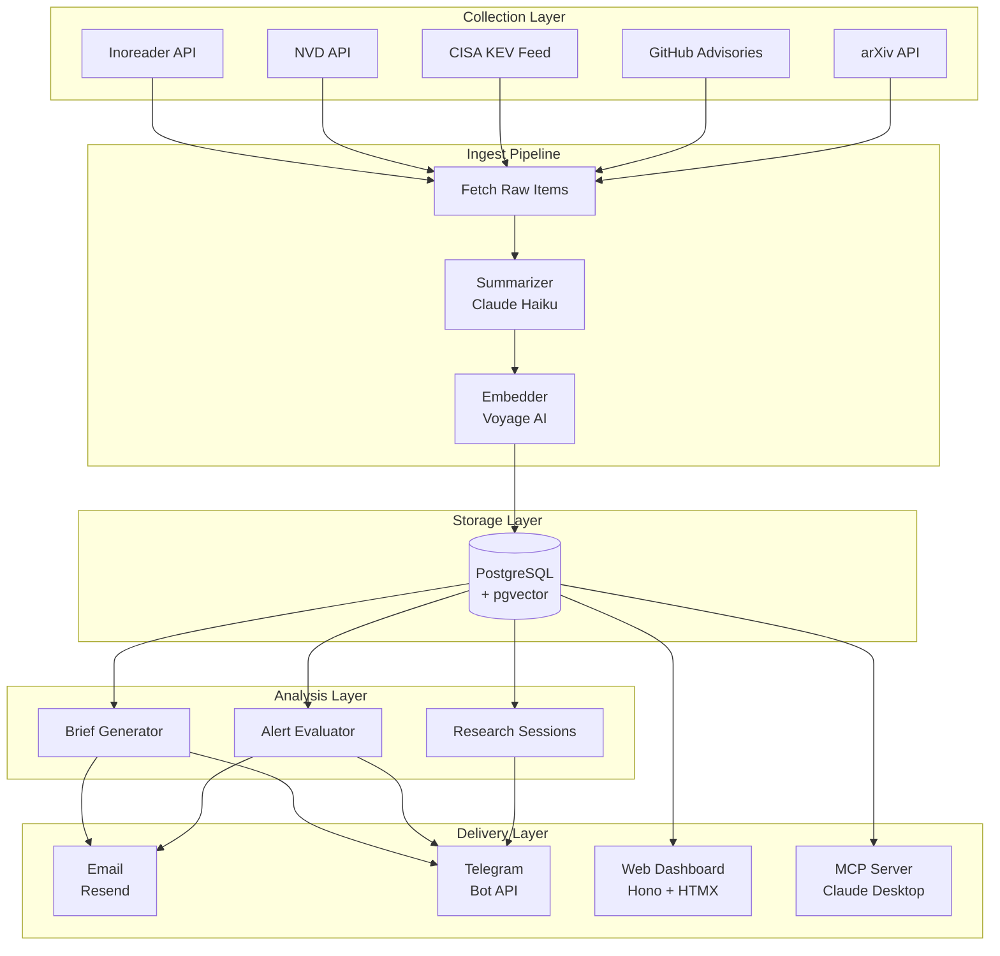
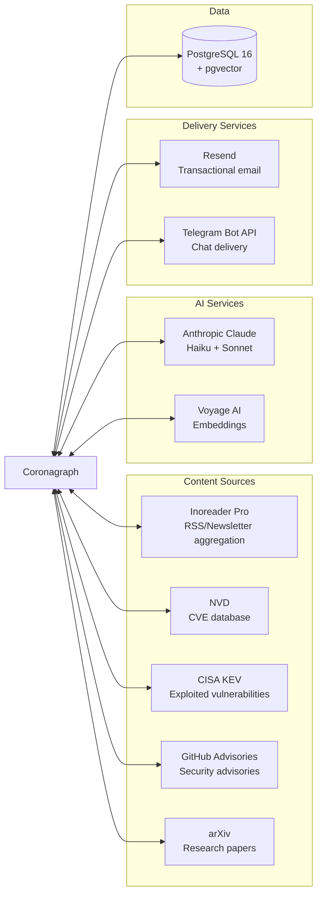

# System Architecture

Five collectors feed items through a summarize-and-embed pipeline into PostgreSQL with pgvector. Analysis jobs generate briefs and evaluate alerts. Four delivery surfaces: web, email, Telegram, MCP.

## System Layers

## External Services

## Design Principles

**Graceful degradation** — Every external API key is optional. Missing `ANTHROPIC_API_KEY` means summaries fall back to `content.slice(0, 200)`. Missing `EMBEDDING_API_KEY` means items store without vectors. Missing delivery keys means briefs generate but don't send. See [Configuration](../operations/configuration.md) for the full feature/key matrix.

**Idempotent ingestion** — Upsert on `(source, source_id)`. Re-running collection updates existing items, never duplicates.

**Model tiering** — Haiku for per-item work (summaries, alerts, research). Sonnet for weekly digest only.

**Zero build step** — Bun runs TypeScript and JSX directly via Hono's JSX runtime. Tailwind and HTMX loaded from CDN.

**No auth** — Single operator, no multi-tenancy. The web dashboard has no authentication.

## Tech Stack

| Component | Technology | Version | Purpose |
|-----------|-----------|---------|---------|
| Runtime | Bun | 1.x | TypeScript runtime, test runner, package manager |
| Web framework | Hono | 4.12 | HTTP routing, JSX rendering, middleware |
| ORM | Drizzle | 0.45 | Type-safe SQL queries, schema management, migrations |
| Database | PostgreSQL | 16 | Primary data store |
| Vector search | pgvector | - | Embedding storage, cosine similarity search |
| AI (text) | Anthropic Claude | Haiku 4.5 / Sonnet 4.5 | Summarization, analysis, research |
| AI (embeddings) | Voyage AI | voyage-3 | 1024-dimensional document embeddings |
| Email | Resend | - | Transactional email delivery |
| Telegram | Grammy | 1.40 | Telegram bot framework |
| MCP | @modelcontextprotocol/sdk | 1.27 | Claude Desktop/Code integration |
| Validation | Zod | 4.x | Config and data validation |
| Frontend | HTMX + Tailwind CSS | 2.0 / CDN | Server-rendered interactive UI |
