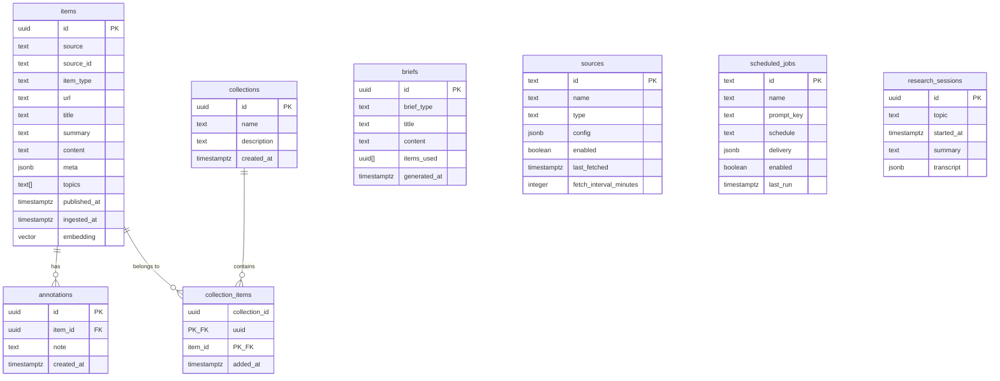
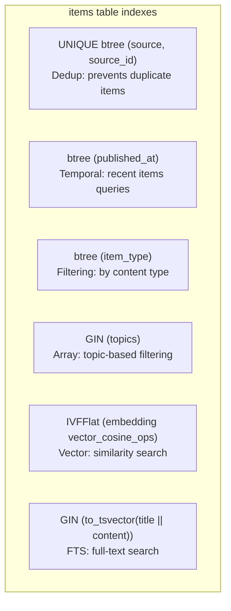

# Database Schema

Coronagraph uses PostgreSQL 16 with the pgvector extension for vector similarity search. Schema is managed by Drizzle ORM with migrations in the `migrations/` directory.

## Entity Relationship Diagram



## Tables

### items

The central table. Each row is one collected item (CVE, paper, article, advisory).

| Column | Type | Constraints | Description |
|--------|------|-------------|-------------|
| `id` | `uuid` | PK, `gen_random_uuid()` | Unique identifier |
| `source` | `text` | NOT NULL | Collector source tag (nvd, arxiv, etc.) |
| `source_id` | `text` | NOT NULL | ID within the source (CVE ID, arXiv ID, etc.) |
| `item_type` | `text` | NOT NULL | Content type (vulnerability, paper, article, advisory) |
| `url` | `text` | nullable | Link to original source |
| `title` | `text` | NOT NULL | Item title |
| `summary` | `text` | nullable | AI-generated or truncated summary |
| `content` | `text` | nullable | Full text content |
| `meta` | `jsonb` | nullable | Source-specific metadata (CVSS, CWE, severity, etc.) |
| `topics` | `text[]` | nullable | Tag array for categorization |
| `published_at` | `timestamptz` | nullable | Original publication date |
| `ingested_at` | `timestamptz` | DEFAULT `now()` | When Coronagraph ingested the item |
| `embedding` | `vector(1024)` | nullable | Voyage AI document embedding |

### annotations

User notes attached to items.

| Column | Type | Constraints | Description |
|--------|------|-------------|-------------|
| `id` | `uuid` | PK, `gen_random_uuid()` | Unique identifier |
| `item_id` | `uuid` | FK → items.id (CASCADE) | Referenced item |
| `note` | `text` | NOT NULL | Annotation text |
| `created_at` | `timestamptz` | DEFAULT `now()` | Creation timestamp |

### collections

Named groups for organizing items.

| Column | Type | Constraints | Description |
|--------|------|-------------|-------------|
| `id` | `uuid` | PK, `gen_random_uuid()` | Unique identifier |
| `name` | `text` | NOT NULL | Collection name |
| `description` | `text` | nullable | Collection description |
| `created_at` | `timestamptz` | DEFAULT `now()` | Creation timestamp |

### collection_items

Many-to-many join between collections and items.

| Column | Type | Constraints | Description |
|--------|------|-------------|-------------|
| `collection_id` | `uuid` | PK, FK → collections.id (CASCADE) | Collection reference |
| `item_id` | `uuid` | PK, FK → items.id (CASCADE) | Item reference |
| `added_at` | `timestamptz` | DEFAULT `now()` | When item was added to collection |

### briefs

Generated briefs and digests.

| Column | Type | Constraints | Description |
|--------|------|-------------|-------------|
| `id` | `uuid` | PK, `gen_random_uuid()` | Unique identifier |
| `brief_type` | `text` | NOT NULL | Type: daily, weekly, flash, research |
| `title` | `text` | nullable | Brief title |
| `content` | `text` | NOT NULL | Full markdown content |
| `items_used` | `uuid[]` | nullable | Array of item IDs used in generation |
| `generated_at` | `timestamptz` | DEFAULT `now()` | Generation timestamp |

### sources

Collector configuration (used by settings page).

| Column | Type | Constraints | Description |
|--------|------|-------------|-------------|
| `id` | `text` | PK | Source identifier (e.g., "nvd") |
| `name` | `text` | NOT NULL | Display name |
| `type` | `text` | NOT NULL | Source type (api, feed, etc.) |
| `config` | `jsonb` | nullable | Source-specific configuration |
| `enabled` | `boolean` | DEFAULT `true` | Whether the source is active |
| `last_fetched` | `timestamptz` | nullable | Last successful fetch time |
| `fetch_interval_minutes` | `integer` | DEFAULT 30 | How often to fetch |

### scheduled_jobs

Recurring job configuration.

| Column | Type | Constraints | Description |
|--------|------|-------------|-------------|
| `id` | `text` | PK | Job identifier |
| `name` | `text` | NOT NULL | Display name |
| `prompt_key` | `text` | NOT NULL | Reference to prompt template |
| `schedule` | `text` | NOT NULL | Cron expression or description |
| `delivery` | `jsonb` | nullable | Delivery configuration (channels, recipients) |
| `enabled` | `boolean` | DEFAULT `true` | Whether the job is active |
| `last_run` | `timestamptz` | nullable | Last execution time |

### research_sessions

Interactive research conversation records.

| Column | Type | Constraints | Description |
|--------|------|-------------|-------------|
| `id` | `uuid` | PK, `gen_random_uuid()` | Unique identifier |
| `topic` | `text` | NOT NULL | Research topic |
| `started_at` | `timestamptz` | DEFAULT `now()` | Session start time |
| `summary` | `text` | nullable | AI-generated session summary (set on end) |
| `transcript` | `jsonb` | nullable | Array of `TranscriptEntry` objects |

## Index Strategy



| Index | Type | Column(s) | Purpose |
|-------|------|-----------|---------|
| `items_source_source_id_idx` | UNIQUE btree | `(source, source_id)` | Ensures upsert idempotency |
| `items_published_at_idx` | btree | `published_at` | Efficient temporal range queries |
| `items_item_type_idx` | btree | `item_type` | Filter by vulnerability, paper, etc. |
| `items_topics_idx` | GIN | `topics` | Array containment queries (`@>`) |
| `items_embedding_idx` | IVFFlat | `embedding vector_cosine_ops` | Approximate nearest neighbor search |
| `items_fts_idx` | GIN | `to_tsvector('english', title \|\| content)` | Full-text search ranking |

### Notes on IVFFlat

The IVFFlat index provides approximate nearest neighbor search. It requires a sufficient number of rows to build effective clustering lists. For small datasets (<1000 rows), exact search may be used instead. The index uses cosine distance (`vector_cosine_ops`), matching the Voyage AI embedding space.

### Custom vector type

The pgvector extension is defined in the schema with a custom Drizzle type:

```typescript
const vector = customType<{
  data: number[];
  driverParam: string;
  config: { dimensions: number };
}>({
  dataType(config) {
    return `vector(${config?.dimensions ?? 1024})`;
  },
  toDriver(value: number[]): string {
    return `[${value.join(",")}]`;
  },
  fromDriver(value: unknown): number[] {
    return String(value)
      .replace(/[\[\]]/g, "")
      .split(",")
      .map(Number);
  },
});
```
